# VeriCrop FinBridge - Detailed Architecture

## System Architecture Overview

VeriCrop FinBridge employs a **Sensor Fusion Architecture** that combines edge computing, cloud services, and blockchain technology to create a resilient, fraud-proof agricultural fintech platform. The architecture is designed for disaster-zone operation with offline-first capabilities.

## High-Level Architecture Diagram

```mermaid
graph TB
    subgraph "Rural Edge Layer"
        FarmerDevice[📱 Farmer Mobile Device<br/>Android/iOS App]
        EdgeGateway[🔧 AWS IoT Greengrass v2<br/>Edge Computing Gateway]
        LocalAI[🧠 Local AI Models<br/>Crop Damage Detection]
        OfflineDB[(💾 SQLite Cache<br/>Offline Claims Storage)]
    end
    
    subgraph "Connectivity & Sync Layer"
        AppSync[🔄 AWS AppSync<br/>GraphQL + Offline Sync]
        SQS[📬 Amazon SQS<br/>Claim Processing Queue]
        EventBridge[⚡ Amazon EventBridge<br/>Event Orchestration]
        CloudWatch[📊 CloudWatch<br/>Monitoring & Alerts]
    end
    
    subgraph "Truth Engine - Forensic Layer"
        Rekognition[👁️ Amazon Rekognition<br/>Video/Image Analysis]
        S3Vault[🔒 S3 Object Lock<br/>Immutable Evidence Vault]
        WeatherAPI[🌦️ Weather Service<br/>IMD Integration]
        GeoValidator[🗺️ Geospatial Validator<br/>GPS & Shadow Analysis]
        FraudEngine[🚨 Fraud Detection<br/>ML-based Risk Scoring]
    end
    
    subgraph "Core Processing Engine"
        StepFunctions[🔄 AWS Step Functions<br/>Truth Engine Orchestrator]
        Lambda[⚡ AWS Lambda<br/>Business Logic Functions]
        DynamoDB[(🗃️ DynamoDB<br/>Claims & User Data)]
        ElastiCache[(⚡ ElastiCache<br/>Session & Cache)]
    end
    
    subgraph "Blockchain Infrastructure"
        AMB[⛓️ Amazon Managed Blockchain<br/>Hyperledger Fabric Network]
        SmartContracts[📜 Smart Contracts<br/>Loss Certificate Logic]
        CertLedger[(📋 Certificate Ledger<br/>Immutable Records)]
    end
    
    subgraph "Financial Services Layer"
        LoanEngine[💰 Bridge Loan Engine<br/>Risk Assessment & Disbursement]
        PaymentGateway[💳 Payment Gateway<br/>UPI/Banking Integration]
        BankingAPIs[🏦 Banking APIs<br/>Account Validation & Transfers]
        InsuranceAPI[🛡️ Insurance Integration<br/>Claim Processing]
    end
    
    subgraph "User Interface Layer"
        VoiceUI[🎤 Amazon Lex<br/>Multi-language Voice Interface]
        WebDashboard[💻 Web Dashboard<br/>Admin & Vendor Portal]
        MobileApp[📱 Mobile Interface<br/>Farmer App UI]
        NotificationService[📢 SNS Notifications<br/>SMS/Push Alerts]
    end
    
    subgraph "Security & Compliance"
        IAM[🔐 AWS IAM<br/>Identity & Access Management]
        KMS[🔑 AWS KMS<br/>Encryption Key Management]
        CloudTrail[📝 CloudTrail<br/>Audit Logging]
        WAF[🛡️ AWS WAF<br/>Web Application Firewall]
    end
    
    %% Edge Layer Connections
    FarmerDevice --> EdgeGateway
    EdgeGateway --> LocalAI
    EdgeGateway --> OfflineDB
    
    %% Sync Layer Connections
    EdgeGateway --> AppSync
    AppSync --> SQS
    SQS --> EventBridge
    EventBridge --> StepFunctions
    
    %% Truth Engine Connections
    StepFunctions --> Rekognition
    StepFunctions --> WeatherAPI
    StepFunctions --> GeoValidator
    StepFunctions --> FraudEngine
    Rekognition --> S3Vault
    
    %% Core Processing
    StepFunctions --> Lambda
    Lambda --> DynamoDB
    Lambda --> ElastiCache
    
    %% Blockchain Integration
    Lambda --> AMB
    AMB --> SmartContracts
    SmartContracts --> CertLedger
    
    %% Financial Services
    Lambda --> LoanEngine
    LoanEngine --> PaymentGateway
    PaymentGateway --> BankingAPIs
    Lambda --> InsuranceAPI
    
    %% User Interfaces
    FarmerDevice --> VoiceUI
    FarmerDevice --> MobileApp
    WebDashboard --> AppSync
    Lambda --> NotificationService
    
    %% Security Layer
    IAM -.-> Lambda
    IAM -.-> AMB
    KMS -.-> S3Vault
    CloudTrail -.-> Lambda
    WAF -.-> WebDashboard
    
    %% Monitoring
    CloudWatch -.-> SQS
    CloudWatch -.-> Lambda
    CloudWatch -.-> StepFunctions
    
    classDef edgeLayer fill:#e1f5fe
    classDef syncLayer fill:#f3e5f5
    classDef truthEngine fill:#fff3e0
    classDef coreEngine fill:#e8f5e8
    classDef blockchain fill:#fce4ec
    classDef financial fill:#f1f8e9
    classDef ui fill:#e3f2fd
    classDef security fill:#ffebee
    
    class FarmerDevice,EdgeGateway,LocalAI,OfflineDB edgeLayer
    class AppSync,SQS,EventBridge,CloudWatch syncLayer
    class Rekognition,S3Vault,WeatherAPI,GeoValidator,FraudEngine truthEngine
    class StepFunctions,Lambda,DynamoDB,ElastiCache coreEngine
    class AMB,SmartContracts,CertLedger blockchain
    class LoanEngine,PaymentGateway,BankingAPIs,InsuranceAPI financial
    class VoiceUI,WebDashboard,MobileApp,NotificationService ui
    class IAM,KMS,CloudTrail,WAF security
```



## Detailed Component Architecture

### 1. Rural Edge Layer - Disaster-Resilient Computing

#### AWS IoT Greengrass v2 Edge Gateway
```yaml
Edge Computing Capabilities:
  - Local AI inference for crop damage assessment
  - Offline claim processing and validation
  - Data compression and optimization
  - Automatic sync when connectivity returns
  
Hardware Requirements:
  - ARM64 or x86_64 processor
  - Minimum 4GB RAM, 32GB storage
  - 4G/LTE connectivity with offline capability
  - GPS module for location verification
  
Deployment Model:
  - Container-based deployment
  - Over-the-air updates
  - Remote monitoring and management
```

#### Local AI Models (Optimized with SageMaker Neo)
```python
# Edge AI Model Pipeline
class EdgeAIProcessor:
    def __init__(self):
        self.damage_classifier = load_neo_model("crop-damage-classifier")
        self.fraud_detector = load_neo_model("preliminary-fraud-detection")
        self.quality_assessor = load_neo_model("evidence-quality-assessment")
    
    def process_claim_offline(self, evidence_package):
        # Preliminary damage assessment
        damage_score = self.damage_classifier.predict(evidence_package.images)
        
        # Basic fraud detection
        fraud_risk = self.fraud_detector.analyze(evidence_package)
        
        # Evidence quality check
        quality_score = self.quality_assessor.evaluate(evidence_package)
        
        return OfflineValidationResult(
            damage_score=damage_score,
            fraud_risk=fraud_risk,
            quality_score=quality_score,
            requires_cloud_validation=fraud_risk > 0.3
        )
```

### 2. Truth Engine - Forensic Validation System

#### Multi-Layer Validation Pipeline


#### Forensic Analysis Components

**Shadow Angle Analysis Algorithm**
```typescript
interface ShadowAnalyzer {
  analyzeShadowConsistency(
    videoFrames: VideoFrame[],
    gpsCoordinates: GPSCoordinates,
    timestamp: Date
  ): ShadowAnalysisResult;
}

class GeospatialShadowAnalyzer implements ShadowAnalyzer {
  analyzeShadowConsistency(frames, coords, timestamp): ShadowAnalysisResult {
    // Calculate expected shadow angle based on sun position
    const sunPosition = this.calculateSunPosition(coords, timestamp);
    const expectedShadowAngle = this.calculateExpectedShadowAngle(sunPosition);
    
    // Extract actual shadow angles from video frames
    const actualShadowAngles = frames.map(frame => 
      this.extractShadowAngle(frame)
    );
    
    // Calculate variance and detect anomalies
    const variance = this.calculateVariance(expectedShadowAngle, actualShadowAngles);
    const anomalyDetected = variance > SHADOW_VARIANCE_THRESHOLD;
    
    return {
      expectedShadowAngle,
      actualShadowAngles,
      variance,
      confidence: this.calculateConfidence(variance),
      anomalyDetected
    };
  }
}
```

**Weather Correlation Engine**
```typescript
class WeatherCorrelationEngine {
  async correlateWeatherWithDamage(
    claimLocation: GPSCoordinates,
    claimTimestamp: Date,
    damageType: DamageType
  ): Promise<WeatherCorrelation> {
    
    // Fetch real-time and historical weather data
    const currentWeather = await this.imdAPI.getCurrentWeather(claimLocation);
    const historicalWeather = await this.imdAPI.getHistoricalWeather(
      claimLocation, 
      claimTimestamp, 
      7 // days before claim
    );
    
    // Analyze weather patterns for damage type
    const expectedDamagePattern = this.getDamagePatternForWeather(
      historicalWeather, 
      damageType
    );
    
    // Calculate correlation score
    const correlationScore = this.calculateCorrelation(
      expectedDamagePattern,
      claimTimestamp
    );
    
    return {
      correlationScore,
      weatherEvents: historicalWeather.events,
      anomalies: this.detectWeatherAnomalies(currentWeather, historicalWeather),
      confidence: correlationScore > 0.7 ? 'HIGH' : 'LOW'
    };
  }
}
```

### 3. Blockchain Infrastructure - Hyperledger Fabric Network

#### Network Topology
```yaml
Blockchain Network Configuration:
  Organizations:
    - FarmersOrg: Crop damage claim submissions
    - InsurersOrg: Claim validation and payouts
    - LendersOrg: Bridge loan processing
    - VendorsOrg: Certificate verification
    - RegulatorsOrg: Audit and compliance
  
  Channels:
    - claims-channel: Claim processing and validation
    - certificates-channel: Loss certificate issuance
    - loans-channel: Bridge loan management
    - audit-channel: Regulatory compliance
  
  Consensus: RAFT (for better performance in private network)
  
  Smart Contracts:
    - LossCertificateContract: Certificate lifecycle
    - BridgeLoanContract: Loan management
    - AuditContract: Compliance tracking
```

#### Loss Certificate Smart Contract
```javascript
'use strict';

const { Contract } = require('fabric-contract-api');

class LossCertificateContract extends Contract {
    
    async initLedger(ctx) {
        console.info('============= START : Initialize Ledger ===========');
        // Initialize with empty state
        console.info('============= END : Initialize Ledger ===========');
    }

    async issueLossCertificate(ctx, certificateId, farmerDID, claimData, validationProof) {
        console.info('============= START : Issue Loss Certificate ===========');
        
        // Validate input parameters
        if (!certificateId || !farmerDID || !claimData || !validationProof) {
            throw new Error('Missing required parameters');
        }
        
        // Parse validation proof
        const proof = JSON.parse(validationProof);
        if (proof.overallScore < 0.7) {
            throw new Error('Insufficient validation score for certificate issuance');
        }
        
        // Create certificate object
        const certificate = {
            id: certificateId,
            farmerDID: farmerDID,
            claimId: JSON.parse(claimData).claimId,
            damageAmount: JSON.parse(claimData).estimatedLoss,
            cropType: JSON.parse(claimData).cropType,
            validationScore: proof.overallScore,
            forensicHash: proof.evidenceHash,
            issuedAt: new Date().toISOString(),
            issuedBy: 'VeriCrop-TruthEngine',
            status: 'ACTIVE',
            collateralValue: this.calculateCollateralValue(JSON.parse(claimData).estimatedLoss),
            linkedLoans: [],
            version: '1.0'
        };
        
        // Store certificate on blockchain
        await ctx.stub.putState(certificateId, Buffer.from(JSON.stringify(certificate)));
        
        // Emit certificate issued event
        ctx.stub.setEvent('CertificateIssued', Buffer.from(JSON.stringify({
            certificateId: certificateId,
            farmerDID: farmerDID,
            collateralValue: certificate.collateralValue
        })));
        
        console.info('============= END : Issue Loss Certificate ===========');
        return certificate;
    }
    
    async verifyCertificate(ctx, certificateId) {
        const certificateAsBytes = await ctx.stub.getState(certificateId);
        if (!certificateAsBytes || certificateAsBytes.length === 0) {
            throw new Error(`Certificate ${certificateId} does not exist`);
        }
        
        const certificate = JSON.parse(certificateAsBytes.toString());
        
        // Return verification result
        return {
            exists: true,
            isValid: certificate.status === 'ACTIVE',
            collateralValue: certificate.collateralValue,
            issuedAt: certificate.issuedAt,
            validationScore: certificate.validationScore
        };
    }
    
    async linkLoanToCertificate(ctx, certificateId, loanId, loanAmount) {
        const certificateAsBytes = await ctx.stub.getState(certificateId);
        if (!certificateAsBytes || certificateAsBytes.length === 0) {
            throw new Error(`Certificate ${certificateId} does not exist`);
        }
        
        const certificate = JSON.parse(certificateAsBytes.toString());
        
        // Check if certificate can support additional loan
        const totalLinkedLoans = certificate.linkedLoans.reduce((sum, loan) => sum + loan.amount, 0);
        if (totalLinkedLoans + loanAmount > certificate.collateralValue) {
            throw new Error('Loan amount exceeds available collateral value');
        }
        
        // Add loan to certificate
        certificate.linkedLoans.push({
            loanId: loanId,
            amount: loanAmount,
            linkedAt: new Date().toISOString()
        });
        
        await ctx.stub.putState(certificateId, Buffer.from(JSON.stringify(certificate)));
        
        return certificate;
    }
    
    calculateCollateralValue(damageAmount) {
        // Collateral value is 80% of validated damage amount
        return Math.floor(damageAmount * 0.8);
    }
}

module.exports = LossCertificateContract;
```

### 4. Financial Services Integration

#### Bridge Loan Processing Engine
```typescript
class BridgeLoanEngine {
    async processBridgeLoan(certificate: LossCertificate): Promise<BridgeLoan> {
        // Risk assessment based on certificate validation score
        const riskAssessment = await this.assessRisk(certificate);
        
        // Calculate loan amount (max 80% of collateral value)
        const maxLoanAmount = certificate.collateralValue * 0.8;
        const approvedAmount = this.calculateApprovedAmount(maxLoanAmount, riskAssessment);
        
        // Create loan record
        const bridgeLoan: BridgeLoan = {
            id: generateUUID(),
            farmerId: certificate.farmerDID,
            certificateId: certificate.id,
            amount: approvedAmount,
            interestRate: 0, // 0% interest for bridge loans
            disbursedAt: new Date(),
            repaymentDue: this.calculateRepaymentDate(certificate),
            status: 'APPROVED',
            repaymentSource: 'INSURANCE_PAYOUT'
        };
        
        // Disburse funds
        const disbursementResult = await this.paymentGateway.transferFunds({
            recipientAccount: certificate.farmerBankAccount,
            amount: approvedAmount,
            reference: `BRIDGE_LOAN_${bridgeLoan.id}`,
            description: `Emergency bridge loan against Loss Certificate ${certificate.id}`
        });
        
        if (disbursementResult.success) {
            bridgeLoan.status = 'DISBURSED';
            bridgeLoan.transactionId = disbursementResult.transactionId;
            
            // Update blockchain certificate with loan link
            await this.blockchainService.linkLoanToCertificate(
                certificate.id, 
                bridgeLoan.id, 
                approvedAmount
            );
        }
        
        return bridgeLoan;
    }
    
    private async assessRisk(certificate: LossCertificate): Promise<RiskAssessment> {
        return {
            validationScore: certificate.validationScore,
            farmerCreditHistory: await this.getCreditHistory(certificate.farmerDID),
            cropTypeRisk: this.getCropRiskFactor(certificate.cropType),
            seasonalRisk: this.getSeasonalRiskFactor(new Date()),
            overallRisk: 'LOW' // Calculated based on above factors
        };
    }
}
```

### 5. Disaster Resilience & Offline Operation

#### Offline-First Data Synchronization
```typescript
class OfflineDataManager {
    private localDB: SQLiteDatabase;
    private syncQueue: SyncQueue;
    
    async submitClaimOffline(claimData: CropDamageClaim): Promise<OfflineClaimResult> {
        // Store claim locally with offline status
        const offlineClaimId = await this.localDB.insertClaim({
            ...claimData,
            status: 'OFFLINE_PENDING',
            submittedAt: new Date(),
            syncStatus: 'PENDING'
        });
        
        // Add to sync queue
        await this.syncQueue.enqueue({
            type: 'CLAIM_SUBMISSION',
            claimId: offlineClaimId,
            priority: 'HIGH',
            retryCount: 0
        });
        
        // Generate provisional certificate for immediate use
        const provisionalCertificate = await this.generateProvisionalCertificate(claimData);
        
        return {
            offlineClaimId,
            provisionalCertificate,
            estimatedSyncTime: this.estimateSyncTime(),
            status: 'OFFLINE_ACCEPTED'
        };
    }
    
    async syncWhenOnline(): Promise<SyncResult> {
        if (!await this.checkConnectivity()) {
            return { status: 'NO_CONNECTIVITY' };
        }
        
        const pendingClaims = await this.syncQueue.getPendingItems();
        const syncResults = [];
        
        for (const item of pendingClaims) {
            try {
                const result = await this.syncClaimToCloud(item.claimId);
                syncResults.push(result);
                
                // Update local status
                await this.localDB.updateClaimSyncStatus(item.claimId, 'SYNCED');
                await this.syncQueue.markCompleted(item.id);
                
            } catch (error) {
                // Handle sync failures with exponential backoff
                await this.syncQueue.incrementRetry(item.id);
                syncResults.push({ claimId: item.claimId, status: 'FAILED', error: error.message });
            }
        }
        
        return { status: 'COMPLETED', results: syncResults };
    }
}
```

## Data Flow Architecture

### Claim Processing Data Flow


## Security Architecture

### Multi-Layer Security Model
```yaml
Security Layers:
  1. Edge Security:
     - Device attestation and secure boot
     - Local data encryption at rest
     - Secure communication channels
  
  2. Network Security:
     - TLS 1.3 for all communications
     - VPC with private subnets
     - AWS WAF for web application protection
  
  3. Application Security:
     - JWT-based authentication
     - Role-based access control (RBAC)
     - API rate limiting and throttling
  
  4. Data Security:
     - Encryption at rest (AES-256)
     - Encryption in transit (TLS 1.3)
     - Key management with AWS KMS
  
  5. Blockchain Security:
     - Private blockchain network
     - Multi-signature transactions
     - Immutable audit trails
```

### Identity and Access Management
```typescript
interface SecurityModel {
  // Farmer identity verification
  farmerAuthentication: {
    method: 'BIOMETRIC' | 'OTP' | 'DEVICE_BINDING';
    mfaRequired: boolean;
    sessionTimeout: number;
  };
  
  // Role-based permissions
  accessControl: {
    farmers: ['SUBMIT_CLAIMS', 'VIEW_CERTIFICATES', 'APPLY_LOANS'];
    vendors: ['VERIFY_CERTIFICATES', 'VIEW_FARMER_PROFILE'];
    insurers: ['REVIEW_CLAIMS', 'PROCESS_PAYOUTS'];
    auditors: ['VIEW_ALL_RECORDS', 'GENERATE_REPORTS'];
  };
  
  // Data privacy compliance
  dataProtection: {
    piiEncryption: true;
    dataRetention: '7_YEARS';
    rightToErasure: true;
    consentManagement: true;
  };
}
```

## Performance and Scalability

### Auto-Scaling Configuration
```yaml
Scaling Targets:
  Lambda Functions:
    - Concurrent executions: 1000
    - Memory: 512MB - 3008MB (auto-adjust)
    - Timeout: 15 minutes max
  
  DynamoDB:
    - Read capacity: Auto-scaling (5-40000 RCU)
    - Write capacity: Auto-scaling (5-40000 WCU)
    - Global tables for multi-region
  
  Step Functions:
    - Express workflows for high-volume processing
    - Standard workflows for complex orchestration
    - Error handling with exponential backoff
  
  Blockchain:
    - Peer nodes: 3 per organization
    - Orderer nodes: 3 (RAFT consensus)
    - Channel capacity: 1000 TPS per channel
```

### Performance Metrics and SLAs
```yaml
Service Level Agreements:
  Claim Processing Time: < 60 seconds (99.9% of requests)
  System Availability: 99.95% uptime
  Fraud Detection Accuracy: > 99% precision, < 0.1% false positives
  Offline Operation: 72 hours without connectivity
  Data Sync Time: < 5 minutes when connectivity returns
  
Monitoring Metrics:
  - End-to-end claim processing latency
  - Truth Engine validation accuracy
  - Blockchain transaction throughput
  - Edge device health and connectivity
  - Payment gateway success rates
```

This architecture provides a comprehensive, disaster-resilient platform that can operate effectively in rural Indian conditions while maintaining the highest standards of fraud prevention and financial security. The combination of edge computing, cloud services, and blockchain technology creates a robust foundation for solving the agricultural debt trap through instant, verified claim processing.