# VeriCrop FinBridge Architecture Diagram (Mermaid)

You can convert this Mermaid diagram to PNG using online tools like:
- https://mermaid.live/
- https://mermaid-js.github.io/mermaid-live-editor/
- VS Code Mermaid Preview extension

```mermaid
graph TB
    subgraph "🌾 VeriCrop FinBridge - Sensor Fusion Architecture"
        direction TB
        
        subgraph "Edge Layer - Rural Devices"
            direction LR
            Mobile["📱 Farmer Mobile Device<br/>Android/iOS App<br/>📍 GPS Enabled"]
            EdgeGateway["🔧 AWS IoT Greengrass v2<br/>Edge Computing Gateway<br/>⚡ Local Processing"]
            LocalAI["🧠 Local AI Models<br/>🌾 Crop Damage Detection<br/>🔍 Preliminary Validation"]
            OfflineDB[("💾 SQLite Cache<br/>📦 Offline Claims Storage<br/>🔒 Encrypted")]
            Connectivity["📡 4G/LTE Connectivity<br/>🌐 Auto-Sync When Available"]
        end
        
        subgraph "Sync & Queue Layer"
            direction LR
            AppSync["🔄 AWS AppSync<br/>📊 GraphQL API<br/>🔄 Offline Synchronization"]
            SQS["📬 Amazon SQS<br/>⏳ Claim Processing Queue<br/>🔄 FIFO Ordering"]
            EventBridge["⚡ Amazon EventBridge<br/>🎯 Event Orchestration<br/>📡 Real-time Routing"]
            CloudWatch["📊 Amazon CloudWatch<br/>📈 Performance Monitoring<br/>🚨 Alert Management"]
        end
        
        subgraph "Truth Engine - Forensic Validation"
            direction TB
            Rekognition["👁️ Amazon Rekognition<br/>🎥 Video Analysis<br/>🔍 Computer Vision"]
            S3Vault["🔒 Amazon S3 Object Lock<br/>📁 Immutable Evidence Vault<br/>🛡️ Tamper-Proof Storage"]
            WeatherAPI["🌦️ Weather Data Integration<br/>🌡️ IMD Real-time Data<br/>📊 Historical Patterns"]
            GeoValidator["🗺️ Geospatial Validator<br/>📍 GPS Verification<br/>☀️ Shadow Angle Analysis"]
            FraudEngine["🚨 Fraud Detection Engine<br/>🤖 ML Risk Scoring<br/>⚠️ Anomaly Detection"]
        end
        
        subgraph "Core Processing Engine"
            direction LR
            StepFunctions["🔄 AWS Step Functions<br/>🎭 Truth Engine Orchestrator<br/>⚡ Parallel Processing"]
            Lambda["⚡ AWS Lambda Functions<br/>💼 Business Logic<br/>🔧 Serverless Compute"]
            DynamoDB[("🗃️ Amazon DynamoDB<br/>📊 Claims Database<br/>⚡ NoSQL Performance")]
            ElastiCache[("⚡ Amazon ElastiCache<br/>🏃 Session Management<br/>💨 High-Speed Cache")]
        end
        
        subgraph "Blockchain Infrastructure"
            direction TB
            AMB["⛓️ Amazon Managed Blockchain<br/>🏗️ Hyperledger Fabric Network<br/>🔐 Private Consortium"]
            SmartContracts["📜 Smart Contracts<br/>📋 Loss Certificate Logic<br/>🤝 Multi-Party Validation"]
            CertLedger[("📋 Certificate Ledger<br/>🔒 Immutable Records<br/>✅ Audit Trail")]
        end
        
        subgraph "Financial Services Layer"
            direction TB
            LoanEngine["💰 Bridge Loan Engine<br/>📊 Risk Assessment<br/>⚡ Instant Disbursement"]
            PaymentGateway["💳 Payment Gateway<br/>🇮🇳 UPI Integration<br/>🏦 Multi-Bank Support"]
            BankingAPIs["🏦 Banking APIs<br/>✅ Account Validation<br/>💸 Fund Transfers"]
            InsuranceAPI["🛡️ Insurance Integration<br/>📋 Claim Processing<br/>💰 Payout Automation"]
        end
        
        subgraph "User Interface Layer"
            direction LR
            VoiceUI["🎤 Amazon Lex<br/>🗣️ Multi-language Voice<br/>🇮🇳 Regional Dialects"]
            WebDashboard["💻 Web Dashboard<br/>👨‍💼 Admin Portal<br/>📊 Analytics"]
            MobileApp["📱 Mobile Interface<br/>👨‍🌾 Farmer App<br/>📱 Touch & Voice"]
            Notifications["📢 SNS Notifications<br/>📱 Push Alerts<br/>📧 SMS Updates"]
        end
        
        subgraph "Security & Compliance"
            direction LR
            IAM["🔐 AWS IAM<br/>👤 Identity Management<br/>🔑 Role-Based Access"]
            KMS["🔑 AWS KMS<br/>🔒 Encryption Keys<br/>🛡️ Data Protection"]
            CloudTrail["📝 AWS CloudTrail<br/>📋 Audit Logging<br/>🔍 Compliance Tracking"]
            WAF["🛡️ AWS WAF<br/>🚫 Attack Protection<br/>🔒 Web Security"]
        end
    end
    
    %% Data Flow Connections
    Mobile --> EdgeGateway
    EdgeGateway --> LocalAI
    EdgeGateway --> OfflineDB
    EdgeGateway --> Connectivity
    
    Connectivity --> AppSync
    AppSync --> SQS
    SQS --> EventBridge
    EventBridge --> StepFunctions
    
    StepFunctions --> Rekognition
    StepFunctions --> WeatherAPI
    StepFunctions --> GeoValidator
    StepFunctions --> FraudEngine
    Rekognition --> S3Vault
    
    StepFunctions --> Lambda
    Lambda --> DynamoDB
    Lambda --> ElastiCache
    
    Lambda --> AMB
    AMB --> SmartContracts
    SmartContracts --> CertLedger
    
    Lambda --> LoanEngine
    LoanEngine --> PaymentGateway
    PaymentGateway --> BankingAPIs
    Lambda --> InsuranceAPI
    
    Mobile --> VoiceUI
    Mobile --> MobileApp
    WebDashboard --> AppSync
    Lambda --> Notifications
    
    %% Security Connections (dotted)
    IAM -.-> Lambda
    IAM -.-> AMB
    KMS -.-> S3Vault
    CloudTrail -.-> Lambda
    WAF -.-> WebDashboard
    
    %% Monitoring Connections (dotted)
    CloudWatch -.-> SQS
    CloudWatch -.-> Lambda
    CloudWatch -.-> StepFunctions
    
    %% Styling
    classDef edgeLayer fill:#e1f5fe,stroke:#01579b,stroke-width:2px
    classDef syncLayer fill:#f3e5f5,stroke:#4a148c,stroke-width:2px
    classDef truthEngine fill:#fff3e0,stroke:#e65100,stroke-width:2px
    classDef coreEngine fill:#e8f5e8,stroke:#1b5e20,stroke-width:2px
    classDef blockchain fill:#fce4ec,stroke:#880e4f,stroke-width:2px
    classDef financial fill:#f1f8e9,stroke:#33691e,stroke-width:2px
    classDef ui fill:#e3f2fd,stroke:#0d47a1,stroke-width:2px
    classDef security fill:#ffebee,stroke:#b71c1c,stroke-width:2px
    
    class Mobile,EdgeGateway,LocalAI,OfflineDB,Connectivity edgeLayer
    class AppSync,SQS,EventBridge,CloudWatch syncLayer
    class Rekognition,S3Vault,WeatherAPI,GeoValidator,FraudEngine truthEngine
    class StepFunctions,Lambda,DynamoDB,ElastiCache coreEngine
    class AMB,SmartContracts,CertLedger blockchain
    class LoanEngine,PaymentGateway,BankingAPIs,InsuranceAPI financial
    class VoiceUI,WebDashboard,MobileApp,Notifications ui
    class IAM,KMS,CloudTrail,WAF security
```

## Key Performance Indicators

```mermaid
graph LR
    subgraph "⏱️ Performance Metrics"
        A["📊 < 60 seconds<br/>End-to-end Processing"]
        B["🎯 99.9% Accuracy<br/>Fraud Detection"]
        C["⚡ 72 hours<br/>Offline Operation"]
        D["🔄 < 5 minutes<br/>Data Sync Time"]
        E["📈 99.95% Uptime<br/>System Availability"]
    end
    
    classDef metrics fill:#e8f5e8,stroke:#2e7d32,stroke-width:2px
    class A,B,C,D,E metrics
```

## Data Flow Sequence

```mermaid
sequenceDiagram
    participant F as 👨‍🌾 Farmer
    participant E as 🔧 Edge Device
    participant T as 🧠 Truth Engine
    participant B as ⛓️ Blockchain
    participant L as 💰 Loan Engine
    participant P as 💳 Payment
    
    F->>E: 📱 Submit Damage Evidence
    E->>E: 🤖 Local AI Validation
    E->>T: ☁️ Sync to Cloud
    
    par Forensic Analysis
        T->>T: 👁️ Video Analysis
        T->>T: 🌦️ Weather Check
        T->>T: 🗺️ GPS Validation
    end
    
    alt ✅ Validation Approved
        T->>B: 📋 Issue Loss Certificate
        B-->>T: ✅ Certificate Created
        T->>L: 💰 Process Bridge Loan
        L->>P: 💸 Disburse Funds
        P-->>F: 💰 Loan Received (60s)
    else ❌ Validation Rejected
        T-->>F: ❌ Rejection + Feedback
    end
```

