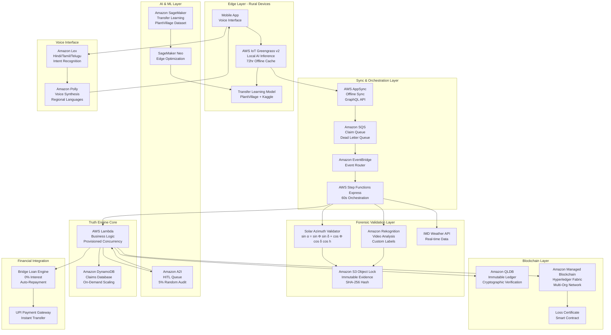

# Design Document: VeriCrop FinBridge

## Overview

VeriCrop FinBridge is a production-ready AWS prototype that solves the Indian agricultural debt trap through a 60-second forensic "Truth Engine" and blockchain-backed bridge loans. The system employs a fully serverless architecture orchestrated by AWS Step Functions Express, combining forensic AI validation, solar azimuth shadow analysis, and blockchain-based certificates to reduce insurance claim-to-cash time from 6 months to 60 seconds.

The platform's core innovation lies in its multi-layered forensic validation system that uses the Solar Azimuth formula (sin α = sin Φ sin δ + cos Φ cos δ cos h) to verify shadow-sun correlation in farmer videos, preventing fraud while enabling instant issuance of blockchain-based Loss Certificates. These certificates serve as collateral for zero-interest bridge loans, providing immediate liquidity to farmers while insurance claims are processed.

The prototype is designed for deployment with available data today, using Transfer Learning on Amazon SageMaker with the PlantVillage dataset and Kaggle Indian Crop images. It features a voice-first UX in regional languages (Hindi/Tamil/Telugu) to serve illiterate farmers, operates offline for 72 hours during network blackouts using AWS IoT Greengrass v2, and includes human-in-the-loop governance via Amazon A2I for responsible AI.

## System Architecture

### Architecture Overview

The system follows a fully serverless, distributed architecture designed for operation in disaster-prone rural areas with unreliable connectivity. The architecture is organized into three logical zones:

1. **Edge/Field Zone**: Farmer interaction and 72-hour offline capability using AWS IoT Greengrass v2
2. **Logic & Analysis Zone**: Forensic Truth Engine with 60-second orchestration via Step Functions Express
3. **Trust & Ledger Zone**: Immutable financial records using Amazon QLDB and Managed Blockchain

### High-Level Architecture Diagram



## Components and Interfaces

### Edge Computing Layer - AWS IoT Greengrass v2

**Greengrass Core Device**
- Runs on Android mobile devices or edge gateways in rural areas
- Provides local AI inference using SageMaker Neo-optimized models
- Enables 72-hour offline operation with local data caching
- Manages automatic synchronization when connectivity returns

**Local Transfer Learning Model**
- Base model: PlantVillage dataset (54,000+ images of healthy and diseased crops)
- Fine-tuned with: Kaggle Indian Crop images (region-specific crops and conditions)
- Optimized with: SageMaker Neo for ARM/Android deployment
- Inference time: <2 seconds per image on edge devices
- Accuracy: 85%+ for crop damage classification (pest, disease, drought, flood, hail)

**Offline Data Management**
```typescript
interface OfflineCache {
  storeClaim(claim: CropDamageClaim): Promise<string>;
  storeEvidence(evidence: VideoEvidence): Promise<string>;
  getQueuedClaims(): Promise<CropDamageClaim[]>;
  syncToCloud(appSyncClient: AppSyncClient): Promise<SyncResult>;
}
```

### Voice-First Interface - Amazon Lex & Polly

**Amazon Lex Configuration**
- Supported languages: Hindi (hi-IN), Tamil (ta-IN), Telugu (te-IN)
- Intent recognition accuracy: 90%+ for agricultural domain
- Fallback handling: Clarifying questions when confidence <70%
- Session management: Maintains context across multi-turn conversations

**Voice Interaction Flow**
```typescript
interface VoiceInterface {
  recognizeIntent(audioInput: AudioStream, language: Language): Promise<Intent>;
  synthesizeSpeech(text: string, language: Language): Promise<AudioStream>;
  guideFarmerThroughClaim(farmerId: string): Promise<ClaimSubmission>;
}

// Example intents
enum ClaimIntent {
  FILE_NEW_CLAIM = "FileCropDamageClaim",
  CHECK_CLAIM_STATUS = "CheckClaimStatus",
  REQUEST_BRIDGE_LOAN = "RequestBridgeLoan",
  SPEAK_TO_HUMAN = "EscalateToHuman"
}
```

**Amazon Polly Voice Synthesis**
- Neural TTS voices for natural-sounding speech
- Regional accent support for better comprehension
- SSML markup for emphasis and pacing in critical instructions


### Forensic Validation Layer - Solar Azimuth Truth Engine

**Solar Azimuth Validator - Mathematical Foundation**

The Solar Azimuth formula verifies shadow-sun correlation to prevent fraud by detecting staged or manipulated videos. This is the core forensic innovation that makes the system fraud-proof.

**Mathematical Formula:**

$$\sin \alpha = \sin \Phi \sin \delta + \cos \Phi \cos \delta \cos h$$

Where:
- $\alpha$ = Solar azimuth angle (angle of sun from true north, 0-360°)
- $\Phi$ = Latitude (from GPS coordinates in video metadata, -90° to 90°)
- $\delta$ = Solar declination (calculated from date/time using Cooper's equation, -23.45° to 23.45°)
- $h$ = Hour angle (calculated from time and longitude, 15° per hour from solar noon)

**Fraud Prevention Mechanism:**

The validator extracts GPS coordinates and timestamp from video metadata, calculates the expected shadow direction using the solar azimuth formula, then compares it against the actual shadow direction measured in the video frames. Any variance exceeding ±5° indicates potential fraud (video recorded at different time/location than claimed) and triggers HITL review.

This approach is superior to simple metadata validation because:
1. It's physically impossible to fake without perfect knowledge of solar geometry
2. It works even if metadata is tampered with (physics doesn't lie)
3. It provides quantitative fraud risk scores rather than binary pass/fail
4. It's computationally efficient (milliseconds per validation)

**Implementation**
```typescript
interface SolarAzimuthValidator {
  calculateExpectedShadowAngle(
    latitude: number,
    longitude: number,
    timestamp: Date
  ): ShadowPrediction;
  
  extractActualShadowAngle(
    videoFrames: VideoFrame[],
    objectDetections: ObjectDetection[]
  ): ShadowMeasurement;
  
  validateShadowCorrelation(
    expected: ShadowPrediction,
    actual: ShadowMeasurement
  ): ValidationResult;
}

interface ShadowPrediction {
  solarAzimuth: number;        // α in degrees
  solarElevation: number;      // altitude angle
  expectedShadowDirection: number;  // 0-360 degrees
  confidence: number;          // based on GPS accuracy
}

interface ShadowMeasurement {
  measuredShadowDirection: number;  // extracted from video
  shadowLength: number;        // relative to object height
  measurementConfidence: number;    // based on image quality
  detectionMethod: string;     // edge detection, object tracking
}

interface ValidationResult {
  isValid: boolean;
  angleVariance: number;       // degrees difference
  fraudRisk: FraudRiskLevel;
  explanation: string;
}
```

**Solar Declination Calculation**
```typescript
function calculateSolarDeclination(date: Date): number {
  const dayOfYear = getDayOfYear(date);
  // Cooper's equation for solar declination
  const declination = 23.45 * Math.sin(
    (360 / 365) * (dayOfYear - 81) * (Math.PI / 180)
  );
  return declination;
}

function calculateHourAngle(time: Date, longitude: number): number {
  const solarNoon = 12.0; // simplified, can adjust for equation of time
  const localTime = time.getHours() + time.getMinutes() / 60;
  const hourAngle = 15 * (localTime - solarNoon); // 15 degrees per hour
  return hourAngle;
}
```

**Fraud Detection Logic**
```typescript
function detectShadowFraud(
  expected: ShadowPrediction,
  actual: ShadowMeasurement
): FraudAssessment {
  const angleVariance = Math.abs(expected.expectedShadowDirection - actual.measuredShadowDirection);
  
  // Tolerance: ±5 degrees for GPS/measurement errors
  const TOLERANCE = 5.0;
  
  if (angleVariance > TOLERANCE) {
    return {
      fraudDetected: true,
      confidence: 0.95,
      reason: `Shadow angle variance ${angleVariance.toFixed(1)}° exceeds tolerance`,
      recommendation: "Route to HITL queue for human review"
    };
  }
  
  return {
    fraudDetected: false,
    confidence: 0.98,
    reason: "Shadow-sun correlation validated",
    recommendation: "Proceed with claim processing"
  };
}
```


**Amazon Rekognition Integration**
- Custom Labels model trained on crop damage patterns
- Video analysis for object detection (crops, damage indicators)
- Shadow extraction using edge detection algorithms
- Metadata extraction (GPS, timestamp, device info) for forensic validation

**Weather Data Correlation**
```typescript
interface WeatherValidator {
  fetchWeatherData(
    location: GPSCoordinates,
    timeRange: TimeRange
  ): Promise<WeatherData>;
  
  correlateWithDamage(
    weather: WeatherData,
    damageType: DamageType
  ): CorrelationResult;
}

interface WeatherData {
  rainfall: number;           // mm in 48 hours
  temperature: number;        // celsius
  windSpeed: number;          // km/h
  humidity: number;           // percentage
  cloudCover: number;         // percentage
  extremeEvents: WeatherEvent[];  // cyclone, hail, etc.
}

interface CorrelationResult {
  isConsistent: boolean;
  correlationScore: number;   // 0-1
  anomalies: string[];
  recommendation: string;
}
```

### AWS Step Functions Express - 60-Second Orchestration

**Express Workflow for High-Throughput Processing**

AWS Step Functions Express workflows are optimized for high-volume, short-duration workloads (exactly our 60-second requirement). Key advantages:

- **Synchronous execution**: Returns results immediately within the 60-second window
- **High throughput**: Handles 100,000+ executions per second during disaster surges
- **Cost-effective**: 90% cheaper than Standard workflows for short-duration tasks
- **Automatic scaling**: No capacity planning required

**Concurrency and Disaster Resilience:**

During peak disaster windows (e.g., cyclone aftermath), the system handles thousands of simultaneous claims:

1. **Amazon SQS buffering**: Absorbs traffic spikes without data loss, FIFO queues ensure ordered processing
2. **Lambda provisioned concurrency**: Eliminates cold starts for critical functions (Solar Azimuth, AI Inference)
3. **DynamoDB on-demand capacity**: Automatically scales to handle write/read bursts
4. **Step Functions Express**: Parallel execution of forensic validation steps reduces total time
5. **EventBridge routing**: Distributes load across multiple processing pipelines

**Timeout Management:**

Each Step Functions state has explicit timeouts to ensure 60-second SLA:
- Submission validation: 5 seconds
- Parallel forensic validation: 45 seconds (Solar: 10s, Weather: 8s, AI: 5s, Rekognition: 15s)
- Result consolidation: 3 seconds
- Certificate issuance: 5 seconds
- Loan disbursement: 5 seconds

Total: 58 seconds (2-second buffer for network latency)

**Express Workflow Definition**
```json
{
  "Comment": "VeriCrop Truth Engine - 60 Second Processing",
  "StartAt": "ValidateSubmission",
  "TimeoutSeconds": 60,
  "States": {
    "ValidateSubmission": {
      "Type": "Task",
      "Resource": "arn:aws:lambda:ap-south-1:account:function:ValidateSubmission",
      "TimeoutSeconds": 5,
      "Next": "ParallelForensicValidation",
      "Catch": [{
        "ErrorEquals": ["States.ALL"],
        "Next": "RejectClaim"
      }]
    },
    "ParallelForensicValidation": {
      "Type": "Parallel",
      "TimeoutSeconds": 45,
      "Branches": [
        {
          "StartAt": "SolarAzimuthValidation",
          "States": {
            "SolarAzimuthValidation": {
              "Type": "Task",
              "Resource": "arn:aws:lambda:ap-south-1:account:function:SolarAzimuthValidator",
              "TimeoutSeconds": 10,
              "End": true
            }
          }
        },
        {
          "StartAt": "WeatherCorrelation",
          "States": {
            "WeatherCorrelation": {
              "Type": "Task",
              "Resource": "arn:aws:lambda:ap-south-1:account:function:WeatherValidator",
              "TimeoutSeconds": 8,
              "End": true
            }
          }
        },
        {
          "StartAt": "AIInference",
          "States": {
            "AIInference": {
              "Type": "Task",
              "Resource": "arn:aws:lambda:ap-south-1:account:function:CropDamageClassifier",
              "TimeoutSeconds": 5,
              "End": true
            }
          }
        },
        {
          "StartAt": "RekognitionAnalysis",
          "States": {
            "RekognitionAnalysis": {
              "Type": "Task",
              "Resource": "arn:aws:lambda:ap-south-1:account:function:RekognitionAnalyzer",
              "TimeoutSeconds": 15,
              "End": true
            }
          }
        }
      ],
      "Next": "ConsolidateResults"
    },
    "ConsolidateResults": {
      "Type": "Task",
      "Resource": "arn:aws:lambda:ap-south-1:account:function:ConsolidateValidation",
      "TimeoutSeconds": 3,
      "Next": "CheckConfidence"
    },
    "CheckConfidence": {
      "Type": "Choice",
      "Choices": [
        {
          "Variable": "$.validationConfidence",
          "NumericLessThan": 0.85,
          "Next": "RouteToHITL"
        },
        {
          "Variable": "$.fraudRisk",
          "StringEquals": "HIGH",
          "Next": "RouteToHITL"
        },
        {
          "Variable": "$.validationResult",
          "StringEquals": "APPROVED",
          "Next": "IssueLossCertificate"
        }
      ],
      "Default": "RejectClaim"
    },
    "RouteToHITL": {
      "Type": "Task",
      "Resource": "arn:aws:lambda:ap-south-1:account:function:RouteToA2I",
      "TimeoutSeconds": 2,
      "End": true
    },
    "IssueLossCertificate": {
      "Type": "Task",
      "Resource": "arn:aws:lambda:ap-south-1:account:function:IssueCertificate",
      "TimeoutSeconds": 5,
      "Next": "DisburseBridgeLoan"
    },
    "DisburseBridgeLoan": {
      "Type": "Task",
      "Resource": "arn:aws:lambda:ap-south-1:account:function:DisburseLoan",
      "TimeoutSeconds": 5,
      "End": true
    },
    "RejectClaim": {
      "Type": "Task",
      "Resource": "arn:aws:lambda:ap-south-1:account:function:RejectClaim",
      "TimeoutSeconds": 2,
      "End": true
    }
  }
}
```


### Blockchain Layer - Amazon QLDB & Managed Blockchain

**Amazon QLDB for Immutable Ledger**
```typescript
interface QLDBLedgerService {
  createLossCertificate(certificate: LossCertificate): Promise<CertificateRecord>;
  verifyCertificate(certificateId: string): Promise<VerificationResult>;
  getCertificateHistory(certificateId: string): Promise<CertificateHistory>;
  updateCertificateStatus(certificateId: string, status: CertificateStatus): Promise<void>;
}

interface CertificateRecord {
  certificateId: string;
  blockAddress: string;        // QLDB block address
  documentHash: string;         // SHA-256 hash
  metadata: {
    version: number;
    txTime: Date;
    txId: string;
  };
}

interface VerificationResult {
  isValid: boolean;
  certificateData: LossCertificate;
  cryptographicProof: {
    documentHash: string;
    blockHash: string;
    proof: string[];           // Merkle proof
  };
}
```

**Amazon Managed Blockchain - Hyperledger Fabric**

Multi-organization network setup:
- Farmers Organization: Submit claims, receive certificates
- Insurers Organization: Validate claims, process payouts
- Lenders Organization: Verify certificates, disburse loans
- Vendors Organization: Accept certificates as collateral

**Smart Contract for Loss Certificates**
```javascript
'use strict';

const { Contract } = require('fabric-contract-api');

class LossCertificateContract extends Contract {
    
    async initLedger(ctx) {
        console.info('Initializing Loss Certificate Ledger');
    }
    
    async issueCertificate(ctx, certificateId, farmerDID, damageAmount, validationScore, gpsLocation) {
        const certificate = {
            certificateId: certificateId,
            farmerDID: farmerDID,
            damageAmount: parseFloat(damageAmount),
            validationScore: parseFloat(validationScore),
            gpsLocation: gpsLocation,
            issuedAt: new Date().toISOString(),
            status: 'ACTIVE',
            collateralValue: parseFloat(damageAmount) * 0.7, // 70% loan-to-value
            linkedLoans: [],
            insurancePayouts: []
        };
        
        await ctx.stub.putState(certificateId, Buffer.from(JSON.stringify(certificate)));
        
        // Emit event for real-time notifications
        ctx.stub.setEvent('CertificateIssued', Buffer.from(JSON.stringify({
            certificateId: certificateId,
            farmerDID: farmerDID,
            timestamp: certificate.issuedAt
        })));
        
        return certificate;
    }
    
    async verifyCertificate(ctx, certificateId) {
        const certificateBytes = await ctx.stub.getState(certificateId);
        
        if (!certificateBytes || certificateBytes.length === 0) {
            throw new Error(`Certificate ${certificateId} does not exist`);
        }
        
        const certificate = JSON.parse(certificateBytes.toString());
        
        return {
            exists: true,
            isActive: certificate.status === 'ACTIVE',
            collateralValue: certificate.collateralValue,
            certificate: certificate
        };
    }
    
    async linkLoan(ctx, certificateId, loanId, loanAmount, lenderDID) {
        const certificateBytes = await ctx.stub.getState(certificateId);
        
        if (!certificateBytes || certificateBytes.length === 0) {
            throw new Error(`Certificate ${certificateId} does not exist`);
        }
        
        const certificate = JSON.parse(certificateBytes.toString());
        
        if (certificate.status !== 'ACTIVE') {
            throw new Error(`Certificate ${certificateId} is not active`);
        }
        
        certificate.linkedLoans.push({
            loanId: loanId,
            loanAmount: parseFloat(loanAmount),
            lenderDID: lenderDID,
            disbursedAt: new Date().toISOString(),
            status: 'OUTSTANDING'
        });
        
        await ctx.stub.putState(certificateId, Buffer.from(JSON.stringify(certificate)));
        
        return certificate;
    }
    
    async recordInsurancePayout(ctx, certificateId, payoutAmount, insurerDID) {
        const certificateBytes = await ctx.stub.getState(certificateId);
        
        if (!certificateBytes || certificateBytes.length === 0) {
            throw new Error(`Certificate ${certificateId} does not exist`);
        }
        
        const certificate = JSON.parse(certificateBytes.toString());
        
        certificate.insurancePayouts.push({
            payoutAmount: parseFloat(payoutAmount),
            insurerDID: insurerDID,
            paidAt: new Date().toISOString()
        });
        
        // Auto-repay linked loans
        for (let loan of certificate.linkedLoans) {
            if (loan.status === 'OUTSTANDING') {
                loan.status = 'REPAID';
                loan.repaidAt = new Date().toISOString();
            }
        }
        
        certificate.status = 'CLOSED';
        
        await ctx.stub.putState(certificateId, Buffer.from(JSON.stringify(certificate)));
        
        return certificate;
    }
    
    async getCertificateHistory(ctx, certificateId) {
        const iterator = await ctx.stub.getHistoryForKey(certificateId);
        const history = [];
        
        let result = await iterator.next();
        while (!result.done) {
            const record = {
                txId: result.value.txId,
                timestamp: result.value.timestamp,
                isDelete: result.value.isDelete,
                value: result.value.value.toString('utf8')
            };
            history.push(record);
            result = await iterator.next();
        }
        
        await iterator.close();
        return history;
    }
}

module.exports = LossCertificateContract;
```


### Human-in-the-Loop - Amazon A2I Integration

**A2I Workflow Configuration**
```typescript
interface A2IWorkflow {
  createHumanReviewTask(
    claim: CropDamageClaim,
    validationResults: ValidationResults,
    reason: HITLReason
  ): Promise<TaskARN>;
  
  getReviewResult(taskARN: string): Promise<HumanReviewResult>;
  
  configureWorkforce(
    workteam: string,
    reviewers: Reviewer[]
  ): Promise<void>;
}

enum HITLReason {
  LOW_CONFIDENCE = "Validation confidence below 85%",
  HIGH_FRAUD_RISK = "Fraud indicators detected",
  RANDOM_AUDIT = "5% random quality check",
  WEATHER_ANOMALY = "Weather data inconsistent with damage",
  SHADOW_VARIANCE = "Shadow angle variance exceeds tolerance"
}

interface HumanReviewResult {
  taskARN: string;
  reviewerDecision: "APPROVE" | "REJECT" | "ESCALATE";
  confidence: number;
  rationale: string;
  reviewedAt: Date;
  reviewerId: string;
  feedbackForAI: string;  // Used to improve model
}
```

**A2I Task Template**
```json
{
  "taskTitle": "Review Crop Damage Claim",
  "taskDescription": "Validate crop damage claim evidence and AI analysis results",
  "taskKeywords": ["agriculture", "insurance", "fraud-detection"],
  "numberOfHumanWorkersPerDataObject": 2,
  "taskTimeLimitInSeconds": 14400,
  "taskAvailabilityLifetimeInSeconds": 86400,
  "maxConcurrentTaskCount": 100,
  "annotationConsolidationConfig": {
    "annotationConsolidationLambdaArn": "arn:aws:lambda:ap-south-1:account:function:ConsolidateReviews"
  },
  "humanTaskConfig": {
    "workteamArn": "arn:aws:sagemaker:ap-south-1:account:workteam/vericrop-reviewers",
    "uiConfig": {
      "humanTaskUiArn": "arn:aws:sagemaker:ap-south-1:account:human-task-ui/vericrop-review"
    },
    "taskTitle": "Validate Crop Damage Claim",
    "taskDescription": "Review video evidence, AI analysis, and fraud indicators to approve or reject claim"
  }
}
```

**Random Audit Selection**
```typescript
function shouldRouteToAudit(claim: CropDamageClaim): boolean {
  // 5% random audit regardless of confidence
  const randomValue = Math.random();
  if (randomValue < 0.05) {
    return true;
  }
  return false;
}

function determineHITLRoute(
  validationResults: ValidationResults,
  claim: CropDamageClaim
): HITLDecision {
  // Low confidence check
  if (validationResults.overallScore < 0.85) {
    return {
      routeToHITL: true,
      reason: HITLReason.LOW_CONFIDENCE,
      priority: "HIGH"
    };
  }
  
  // Fraud risk check
  if (validationResults.fraudRisk === "HIGH") {
    return {
      routeToHITL: true,
      reason: HITLReason.HIGH_FRAUD_RISK,
      priority: "URGENT"
    };
  }
  
  // Random audit check
  if (shouldRouteToAudit(claim)) {
    return {
      routeToHITL: true,
      reason: HITLReason.RANDOM_AUDIT,
      priority: "NORMAL"
    };
  }
  
  return {
    routeToHITL: false,
    reason: null,
    priority: null
  };
}
```


### Transfer Learning Model - SageMaker Training

**Dataset Composition**
- Base dataset: PlantVillage (54,000+ images, 38 crop-disease classes)
- Fine-tuning dataset: Kaggle Indian Crop images (region-specific crops)
- Augmentation: Rotation, brightness, weather overlays for robustness

**SageMaker Training Job**
```python
import sagemaker
from sagemaker.tensorflow import TensorFlow

# Transfer learning with MobileNetV2 for edge deployment
estimator = TensorFlow(
    entry_point='train.py',
    role='arn:aws:iam::account:role/SageMakerRole',
    instance_count=1,
    instance_type='ml.p3.2xlarge',
    framework_version='2.12',
    py_version='py310',
    hyperparameters={
        'base_model': 'MobileNetV2',
        'epochs': 50,
        'batch_size': 32,
        'learning_rate': 0.0001,
        'freeze_layers': 100,  # Freeze base layers
        'target_classes': 5,   # pest, disease, drought, flood, hail
        'input_size': 224
    }
)

# Training data from S3
estimator.fit({
    'train': 's3://vericrop-data/plantvillage-train/',
    'validation': 's3://vericrop-data/plantvillage-val/',
    'finetune': 's3://vericrop-data/indian-crops/'
})
```

**Model Optimization with SageMaker Neo**
```python
import boto3

sagemaker_client = boto3.client('sagemaker')

# Compile model for Android ARM devices
compilation_job = sagemaker_client.create_compilation_job(
    CompilationJobName='vericrop-model-android',
    RoleArn='arn:aws:iam::account:role/SageMakerRole',
    InputConfig={
        'S3Uri': 's3://vericrop-models/trained-model.tar.gz',
        'DataInputConfig': '{"input_1":[1,224,224,3]}',
        'Framework': 'TENSORFLOW'
    },
    OutputConfig={
        'S3OutputLocation': 's3://vericrop-models/compiled/',
        'TargetDevice': 'rasp3b'  # ARM Cortex-A53 (similar to Android)
    },
    StoppingCondition={
        'MaxRuntimeInSeconds': 900
    }
)
```

**Edge Inference with Greengrass**
```typescript
interface EdgeInferenceService {
  loadModel(modelPath: string): Promise<void>;
  classifyDamage(imageData: ImageData): Promise<DamageClassification>;
  getBatchPredictions(images: ImageData[]): Promise<DamageClassification[]>;
}

interface DamageClassification {
  damageType: "pest" | "disease" | "drought" | "flood" | "hail" | "healthy";
  confidence: number;
  severity: "low" | "medium" | "high";
  inferenceTime: number;  // milliseconds
}
```


## Data Models

### Security and Monitoring

**Zero-Trust Security Model**

The system implements a comprehensive Zero-Trust architecture:

1. **AWS KMS Encryption**:
   - Data at rest: All DynamoDB tables, S3 buckets, and QLDB ledgers encrypted with customer-managed KMS keys
   - Data in transit: TLS 1.3 for all API communications
   - Key rotation: Automatic annual rotation with audit trail

2. **Amazon Cognito Authentication**:
   - Multi-factor authentication for farmers (SMS OTP)
   - Decentralized Identifiers (DIDs) for privacy-preserving farmer identity
   - JWT tokens with 1-hour expiration for API access

3. **IAM Least Privilege**:
   - Lambda functions have minimal IAM permissions (only what they need)
   - Cross-account roles for financial institution integration
   - Service Control Policies (SCPs) prevent privilege escalation

4. **S3 Object Lock Compliance Mode**:
   - Evidence files locked for 7 years (regulatory requirement)
   - Legal hold capability for fraud investigations
   - Versioning enabled to detect tampering attempts

5. **VPC Isolation**:
   - Lambda functions run in private VPC subnets
   - No direct internet access (NAT Gateway for outbound only)
   - VPC endpoints for AWS service communication (no public internet)

**Monitoring and Observability**

- **Amazon CloudWatch**: Real-time metrics for Step Functions execution time, Lambda errors, DynamoDB throttling
- **AWS X-Ray**: Distributed tracing for end-to-end claim processing latency analysis
- **CloudWatch Alarms**: Automated alerts for 60-second SLA violations, fraud detection anomalies, HITL queue backlog
- **CloudTrail**: Complete audit log of all API calls for compliance and forensic analysis

## Data Models

### Core Domain Models

```typescript
interface Farmer {
  id: string;
  did: string;                    // Decentralized Identifier
  name: string;
  phoneNumber: string;
  preferredLanguage: "hi-IN" | "ta-IN" | "te-IN";
  location: GPSCoordinates;
  bankAccount: BankAccountDetails;
  upiId: string;
  kycStatus: KYCStatus;
  riskProfile: RiskProfile;
  claimHistory: ClaimSummary[];
}

interface CropDamageClaim {
  id: string;
  farmerId: string;
  submittedAt: Date;
  location: GPSCoordinates;
  cropType: CropType;
  damageType: DamageType;
  estimatedLoss: number;
  evidence: EvidencePackage;
  status: ClaimStatus;
  validationResults: ValidationResults;
  processingTime: number;         // milliseconds
  isOfflineSubmission: boolean;
}

interface EvidencePackage {
  videos: VideoEvidence[];
  photos: PhotoEvidence[];
  gpsData: GPSMetadata;
  deviceInfo: DeviceMetadata;
  submissionContext: SubmissionContext;
  immutableStorageLocation: string;  // S3 Object Lock URI
  evidenceHash: string;              // SHA-256
}

interface VideoEvidence {
  id: string;
  s3Location: string;
  duration: number;
  resolution: string;
  metadata: VideoMetadata;
  hashSignature: string;
  rekognitionResults: RekognitionAnalysis;
  shadowAnalysis: ShadowAnalysisResult;
}

interface VideoMetadata {
  gpsCoordinates: GPSCoordinates;
  timestamp: Date;
  deviceModel: string;
  cameraSettings: CameraSettings;
  exifData: ExifData;
}

interface ValidationResults {
  forensicScore: number;           // 0-1
  weatherCorrelation: number;      // 0-1
  gpsValidation: boolean;
  shadowAnalysis: ShadowAnalysisResult;
  aiClassification: DamageClassification;
  overallScore: number;            // 0-1
  fraudRisk: FraudRiskLevel;
  validatedAt: Date;
  validationDuration: number;      // milliseconds
}

interface ShadowAnalysisResult {
  expectedSolarAzimuth: number;    // degrees
  expectedShadowDirection: number; // degrees
  actualShadowDirection: number;   // degrees
  angleVariance: number;           // degrees
  confidence: number;              // 0-1
  fraudDetected: boolean;
  explanation: string;
}

interface LossCertificate {
  id: string;
  blockchainTxId: string;
  qldbBlockAddress?: string;       // If using QLDB
  fabricTxId?: string;             // If using Managed Blockchain
  farmerId: string;
  farmerDID: string;
  claimId: string;
  certificateHash: string;
  damageAmount: number;
  collateralValue: number;         // 70% of damage amount
  validationScore: number;
  issuedAt: Date;
  status: CertificateStatus;
  linkedLoans: LoanReference[];
  insurancePayouts: PayoutReference[];
}

interface BridgeLoan {
  id: string;
  farmerId: string;
  certificateId: string;
  amount: number;
  interestRate: number;            // 0% for bridge loans
  disbursedAt: Date;
  repaymentDue: Date;
  status: LoanStatus;
  repaymentSource: RepaymentSource;
  upiTransactionId: string;
}

interface HITLTask {
  taskARN: string;
  claimId: string;
  reason: HITLReason;
  priority: "URGENT" | "HIGH" | "NORMAL";
  createdAt: Date;
  assignedTo: string[];
  status: "PENDING" | "IN_REVIEW" | "COMPLETED";
  result?: HumanReviewResult;
}
```


## Error Handling

### Resilience Patterns

**Circuit Breaker Pattern**
- Applied to: Weather API calls, Payment gateway, Blockchain transactions
- Failure threshold: 5 consecutive failures
- Timeout: 30 seconds
- Half-open retry: After 60 seconds
- Fallback: Cached weather data, queued payments, local certificate storage

**Retry Logic with Exponential Backoff**
```typescript
async function retryWithBackoff<T>(
  operation: () => Promise<T>,
  maxRetries: number = 3,
  baseDelay: number = 1000
): Promise<T> {
  for (let attempt = 0; attempt < maxRetries; attempt++) {
    try {
      return await operation();
    } catch (error) {
      if (attempt === maxRetries - 1) throw error;
      
      const delay = baseDelay * Math.pow(2, attempt);
      await sleep(delay);
    }
  }
  throw new Error('Max retries exceeded');
}
```

**Graceful Degradation**
- Full validation unavailable → Use local edge validation only
- Blockchain unavailable → Queue certificate issuance, issue provisional certificate
- Payment gateway down → Queue disbursement, notify farmer of delay
- Weather API unavailable → Skip weather correlation, increase HITL routing

### Error Categories and Handling

**Validation Errors**
- Insufficient evidence quality → Request re-submission with specific guidance via voice
- GPS/location mismatch → Flag for HITL review with HIGH priority
- Weather data inconsistency → Route to HITL with weather anomaly reason
- Shadow angle variance > 5° → Flag as fraud, route to HITL with URGENT priority

**System Errors**
- Step Functions timeout (>60s) → Log failure, notify ops team, retry claim
- Lambda cold start delay → Use provisioned concurrency for critical functions
- DynamoDB throttling → Use on-demand capacity mode, implement exponential backoff
- S3 Object Lock failure → Retry with exponential backoff, alert if persistent

**Blockchain Errors**
- QLDB transaction conflict → Retry with new transaction
- Managed Blockchain peer unavailable → Route to alternate peer, queue if all down
- Smart contract execution failure → Log error, route to manual certificate issuance

**Offline Sync Errors**
- AppSync conflict resolution → Use last-writer-wins with timestamp
- Large evidence file upload failure → Chunk upload with resumable transfers
- Sync timeout → Queue for retry, continue with next claim

**Fraud Detection**
- High fraud risk score → Automatic rejection with appeal process
- Suspicious patterns → Flag for HITL with detailed fraud indicators
- Repeated fraud attempts → Account suspension, notify authorities


## Risk & Mitigation Table

| Risk | Impact | Probability | Mitigation Strategy |
|------|--------|-------------|---------------------|
| Solar azimuth calculation errors due to GPS inaccuracy | High - False fraud flags | Medium | Use ±5° tolerance, route borderline cases to HITL |
| Transfer learning model poor performance on Indian crops | High - Incorrect damage classification | Medium | Fine-tune with Kaggle Indian dataset, maintain 85% accuracy threshold |
| 60-second timeout during high load | High - Failed claims | Medium | Use Step Functions Express, provisioned Lambda concurrency, parallel validation |
| Network blackouts exceeding 72 hours | Medium - Delayed processing | Low | Extend offline cache capacity, prioritize sync when connectivity returns |
| Voice recognition failure for regional dialects | Medium - Accessibility issues | Medium | Provide fallback to touch interface, continuous model improvement with A2I feedback |
| Blockchain network congestion | Medium - Certificate issuance delays | Low | Use QLDB as primary (faster), Managed Blockchain as secondary for multi-org |
| Weather API unavailability | Medium - Incomplete validation | Low | Cache historical data, graceful degradation to skip weather check |
| Payment gateway failures | High - No loan disbursement | Low | Retry with exponential backoff, queue for manual processing, notify farmer |
| HITL queue backlog | Medium - Delayed claim resolution | Medium | Scale reviewer workforce, prioritize URGENT cases, 4-hour SLA monitoring |
| Evidence storage costs | Low - Budget overrun | Medium | Use S3 Intelligent-Tiering, compress videos, lifecycle policies for old claims |
| False positive fraud detection | High - Legitimate farmers rejected | Low | Maintain <0.1% false positive rate, provide appeal process, A2I quality checks |
| Model drift over time | Medium - Degraded accuracy | Medium | Continuous monitoring, periodic retraining with new data, A2I feedback loop |


## Correctness Properties

*A property is a characteristic or behavior that should hold true across all valid executions of a system—essentially, a formal statement about what the system should do. Properties serve as the bridge between human-readable specifications and machine-verifiable correctness guarantees.*

After completing prework analysis and property reflection to eliminate redundancy, the following 14 properties capture the essential correctness guarantees of the VeriCrop FinBridge system:

### Core Processing Properties

**Property 1: 60-Second End-to-End Processing Guarantee**
*For any* valid crop damage claim with complete evidence, the system should complete validation (including forensic analysis, weather correlation, AI inference) and either issue a Loss_Certificate with bridge loan disbursement or provide rejection with specific feedback, all within 60 seconds.
**Validates: Requirements 1.1, 1.4, 1.5, 10.2**

**Property 2: Solar Azimuth Calculation Correctness**
*For any* video evidence with GPS coordinates (Φ, longitude) and timestamp, the Solar_Azimuth_Validator should calculate expected shadow direction using the formula sin α = sin Φ sin δ + cos Φ cos δ cos h, where δ is solar declination and h is hour angle derived from the timestamp.
**Validates: Requirements 2.1, 2.2**

**Property 3: Shadow Fraud Detection with Tolerance**
*For any* video evidence, when the measured shadow angle variance from the calculated expected angle exceeds ±5 degrees, the system should flag the claim as potential fraud and route it to the HITL_Queue.
**Validates: Requirements 2.3, 2.4**

**Property 4: Weather Correlation Validation**
*For any* claim validation, the system should fetch weather data for the claim location within 48 hours of the claim timestamp, compare it with reported damage patterns, and flag inconsistencies (e.g., drought damage during heavy rainfall) for HITL review.
**Validates: Requirements 2.5, 9.2, 9.4**

### Voice Interface Properties

**Property 5: Language Consistency in Voice Interaction**
*For any* voice input in supported languages (Hindi, Tamil, Telugu), the system should synthesize responses using Amazon Polly in the same language as the input.
**Validates: Requirements 4.3**

**Property 6: Low-Confidence Clarification**
*For any* voice input with recognition confidence below 70%, the system should ask clarifying questions before proceeding with claim processing.
**Validates: Requirements 4.5**

### Offline Resilience Properties

**Property 7: 72-Hour Offline Operation Continuity**
*For any* claim submitted during network outages, the Greengrass_Core should accept the claim, perform local AI inference, store data securely in Offline_Cache for up to 72 hours, provide provisional Loss_Certificates, and automatically sync to cloud when connectivity returns with full re-validation.
**Validates: Requirements 5.1, 5.2, 5.3, 5.4, 5.5, 5.6, 5.7**

### Blockchain and Certificate Properties

**Property 8: Loss Certificate Completeness and Immutability**
*For any* validated claim, the system should create an immutable Loss_Certificate on the blockchain containing farmer identity, damage assessment, validation timestamp, and cryptographic hash, which cannot be modified or deleted after creation.
**Validates: Requirements 7.2, 7.4**

**Property 9: Certificate Verification and Audit Trail**
*For any* Loss_Certificate, the system should provide cryptographic proof of authenticity through blockchain verification APIs and maintain a complete queryable audit trail of all certificate operations.
**Validates: Requirements 7.3, 7.6, 12.2**

**Property 10: Transaction Recording on Ledger**
*For any* bridge loan disbursement, repayment, or insurance payout event, the system should record the transaction on the Immutable_Ledger with timestamp and update the Loss_Certificate status accordingly.
**Validates: Requirements 7.5, 12.4**

### Financial Integration Properties

**Property 11: Bridge Loan Calculation and Collateral Assignment**
*For any* issued Loss_Certificate, the system should automatically calculate eligible loan amount as exactly 70% of validated damage amount, set the certificate as collateral, and ensure the bridge loan has 0% interest rate.
**Validates: Requirements 10.1, 10.3**

**Property 12: Insurance Payout Auto-Repayment**
*For any* insurance payout received, the system should automatically repay the corresponding bridge loan from the payout amount, and if the payout is insufficient, convert the remaining balance to a standard loan with market interest rates.
**Validates: Requirements 10.4, 10.5**

### Human-in-the-Loop Properties

**Property 13: HITL Routing for Low Confidence and Random Audit**
*For any* claim with validation confidence below 85% or fraud risk marked as HIGH, the system should route it to the HITL_Queue, and additionally, the system should randomly select approximately 5% of all claims for human quality audit regardless of confidence score.
**Validates: Requirements 8.1, 8.2**

**Property 14: HITL Task Completeness**
*For any* claim routed to HITL_Queue, the system should present human reviewers with all evidence files, AI analysis results, fraud indicators, shadow analysis, and weather correlation data, and record the human decision rationale when the review is completed.
**Validates: Requirements 8.3, 8.4**

### Evidence Integrity Properties

**Property 15: Evidence Hash Round-Trip Integrity**
*For any* evidence file (video or photo), the system should calculate a SHA-256 cryptographic hash upon submission, store it immutably, and when the evidence is retrieved, recalculating the hash should produce the same value, verifying file integrity.
**Validates: Requirements 11.2, 11.3**

**Property 16: Evidence Immutability and Audit Logging**
*For any* stored evidence file, attempts to modify or delete it should fail (enforced by S3 Object Lock for 7 years), and all evidence access operations should be logged in a complete audit trail.
**Validates: Requirements 11.4, 11.5**


## Testing Strategy

### Dual Testing Approach

The testing strategy employs both unit tests for specific scenarios and property-based tests for comprehensive validation across all possible inputs. This dual approach ensures both concrete bug detection and general correctness verification.

**Unit Testing Focus:**
- Specific fraud detection scenarios (known fraud patterns, edge cases)
- Integration points between AWS services (Step Functions → Lambda, Lambda → DynamoDB)
- Error handling and recovery mechanisms (circuit breakers, retries, fallbacks)
- Regional language processing accuracy (specific Hindi/Tamil/Telugu phrases)
- Solar azimuth calculation edge cases (polar regions, equinoxes, leap years)
- Blockchain smart contract specific scenarios (certificate issuance, loan linking, payout recording)
- Voice interface specific intents (file claim, check status, request loan)

**Property-Based Testing Focus:**
- Universal validation properties across all claim types and evidence formats
- Solar azimuth calculation correctness across all GPS coordinates and timestamps
- Shadow fraud detection consistency across different angle variances
- Blockchain certificate integrity across all operations (create, verify, update)
- Financial calculation accuracy across all loan scenarios (70% calculation, auto-repayment)
- Offline sync correctness across all network outage durations
- HITL routing logic across all confidence scores and fraud risk levels
- Evidence hash integrity across all file types and sizes

### Property-Based Testing Configuration

**Testing Framework:** fast-check for TypeScript/Node.js Lambda functions
**Minimum Iterations:** 100 runs per property test
**Tag Format:** Feature: vericrop-finbridge, Property {number}: {property_text}

**Example Property Test Structure:**
```typescript
import fc from 'fast-check';
import { describe, it } from '@jest/globals';

describe('Feature: vericrop-finbridge, Property 2: Solar Azimuth Calculation Correctness', () => {
  it('should calculate expected shadow direction using solar azimuth formula for any GPS coordinates and timestamp', () => {
    fc.assert(
      fc.property(
        fc.double({ min: -90, max: 90 }),      // latitude
        fc.double({ min: -180, max: 180 }),    // longitude
        fc.date({ min: new Date('2020-01-01'), max: new Date('2030-12-31') }),
        (latitude, longitude, timestamp) => {
          const result = calculateSolarAzimuth(latitude, longitude, timestamp);
          
          // Verify formula components are calculated
          expect(result.solarDeclination).toBeDefined();
          expect(result.hourAngle).toBeDefined();
          expect(result.solarAzimuth).toBeDefined();
          
          // Verify azimuth is in valid range [0, 360)
          expect(result.solarAzimuth).toBeGreaterThanOrEqual(0);
          expect(result.solarAzimuth).toBeLessThan(360);
          
          // Verify shadow direction is calculated from azimuth
          expect(result.expectedShadowDirection).toBeDefined();
        }
      ),
      { numRuns: 100 }
    );
  });
});
```

### Testing Infrastructure

**AWS Services:**
- AWS CodeBuild for continuous integration
- AWS CodePipeline for automated test execution on commits
- Separate test environments for unit and property tests
- Mock services for external dependencies (IMD Weather API, payment gateways)

**Blockchain Testing:**
- Hyperledger Fabric test networks for smart contract testing
- QLDB test ledgers for certificate operations
- Mock blockchain for fast unit tests

**Edge Testing:**
- Greengrass Core device simulators for offline testing
- Network condition simulators (latency, packet loss, complete outage)
- Mobile device emulators for voice interface testing

**Load and Performance Testing:**
- AWS Distributed Load Testing for disaster scenario simulation
- Step Functions execution time monitoring (60-second SLA)
- Lambda cold start latency measurement
- DynamoDB throughput testing with on-demand capacity

### Security and Compliance Testing

**Penetration Testing:**
- Fraud prevention system bypass attempts
- Blockchain security audits (smart contract vulnerabilities)
- Evidence tampering attempts (S3 Object Lock validation)
- Voice interface injection attacks

**Compliance Testing:**
- Data encryption at rest and in transit (GDPR, Indian data protection)
- Audit trail completeness for regulatory review
- Evidence retention policy enforcement (7-year minimum)
- Multi-language accessibility compliance (WCAG for voice interface)

### Responsible AI Testing

**A2I Quality Monitoring:**
- Human reviewer accuracy tracking
- Inter-reviewer agreement measurement
- Feedback loop effectiveness (AI improvement from human decisions)
- Bias detection in fraud flagging (ensure no discrimination by region/language)

**Model Performance Monitoring:**
- Transfer learning model accuracy on production data
- Drift detection (model performance degradation over time)
- False positive/negative rate tracking
- Confidence calibration (ensure confidence scores are meaningful)


