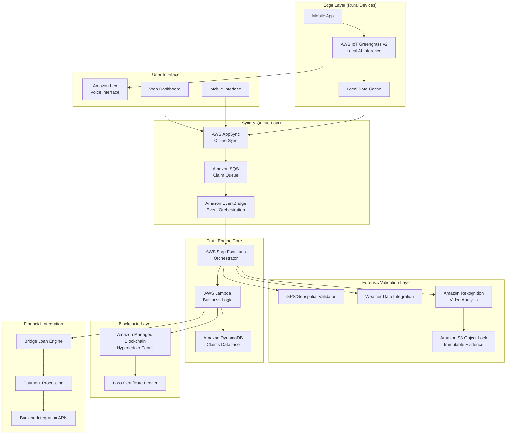

# Design Document: VeriCrop FinBridge

## Overview

VeriCrop FinBridge is a sophisticated agricultural fintech platform that leverages AWS cloud services and edge computing to solve the "Agricultural Debt Trap" for Indian micro-farmers. The system employs a "Sensor Fusion" architecture that combines forensic AI validation, blockchain-based certificates, and offline-first design to reduce insurance claim-to-cash time from 6 months to 60 seconds.

The platform's core innovation lies in its "Truth Engine" - a multi-layered validation system that uses computer vision, geospatial analysis, and weather correlation to provide fraud-proof crop damage assessment. This enables instant issuance of blockchain-based Loss Certificates that serve as collateral for zero-interest bridge loans, providing immediate liquidity to farmers while insurance claims are processed.

## Architecture

The system follows a distributed, resilient architecture designed for operation in disaster-prone rural areas with unreliable connectivity:



## Components and Interfaces

### Edge Computing Layer

**AWS IoT Greengrass v2 Core**
- Replaces discontinued SageMaker Edge Manager for local AI inference
- Runs optimized computer vision models for preliminary damage assessment
- Provides offline operation capability for up to 72 hours
- Manages local data caching and synchronization queues

**Local AI Models**
- Crop damage classification model (optimized with SageMaker Neo)
- Preliminary fraud detection model for basic validation
- Image quality assessment model to ensure evidence standards

**Offline Data Management**
- SQLite database for local claim storage
- Encrypted local file system for evidence caching
- Automatic compression and optimization for limited storage

### Synchronization and Queuing Layer

**AWS AppSync**
- GraphQL API with offline synchronization capabilities
- Conflict resolution for claims submitted from multiple devices
- Real-time updates when connectivity is restored
- Optimistic UI updates for immediate user feedback

**Amazon SQS**
- Dead letter queues for failed claim processing
- FIFO queues for ordered claim processing during high-volume periods
- Visibility timeout management for long-running validation processes
- Integration with CloudWatch for monitoring queue depths

### Forensic Validation Layer

**Amazon Rekognition Integration**
- Custom model training for crop damage patterns
- Shadow angle analysis using geometric algorithms
- Metadata extraction and validation from video files
- Scene analysis to detect staging or manipulation

**Geospatial Validation Engine**
```typescript
interface GeospatialValidator {
  validateLocation(gpsCoords: GPSCoordinates, claimedLocation: string): ValidationResult;
  analyzeShadowAngles(videoMetadata: VideoMetadata, timestamp: Date): ShadowAnalysis;
  crossReferenceWeather(location: GPSCoordinates, timestamp: Date): WeatherCorrelation;
}
```

**Weather Data Integration**
- Real-time weather API integration (IMD - India Meteorological Department)
- Historical weather pattern analysis
- Correlation algorithms between weather events and crop damage patterns
- Anomaly detection for claims inconsistent with weather data

### Truth Engine Core

**AWS Step Functions Orchestrator**
```json
{
  "Comment": "VeriCrop Truth Engine Workflow",
  "StartAt": "ValidateSubmission",
  "States": {
    "ValidateSubmission": {
      "Type": "Task",
      "Resource": "arn:aws:lambda:region:account:function:ValidateSubmission",
      "Next": "ParallelValidation"
    },
    "ParallelValidation": {
      "Type": "Parallel",
      "Branches": [
        {
          "StartAt": "ForensicAnalysis",
          "States": {
            "ForensicAnalysis": {
              "Type": "Task",
              "Resource": "arn:aws:lambda:region:account:function:ForensicAnalysis",
              "End": true
            }
          }
        },
        {
          "StartAt": "WeatherCorrelation",
          "States": {
            "WeatherCorrelation": {
              "Type": "Task",
              "Resource": "arn:aws:lambda:region:account:function:WeatherCorrelation",
              "End": true
            }
          }
        }
      ],
      "Next": "ConsolidateResults"
    },
    "ConsolidateResults": {
      "Type": "Task",
      "Resource": "arn:aws:lambda:region:account:function:ConsolidateResults",
      "Next": "IssueDecision"
    },
    "IssueDecision": {
      "Type": "Choice",
      "Choices": [
        {
          "Variable": "$.validationResult",
          "StringEquals": "APPROVED",
          "Next": "IssueLossCertificate"
        }
      ],
      "Default": "RejectClaim"
    },
    "IssueLossCertificate": {
      "Type": "Task",
      "Resource": "arn:aws:lambda:region:account:function:IssueLossCertificate",
      "End": true
    },
    "RejectClaim": {
      "Type": "Task",
      "Resource": "arn:aws:lambda:region:account:function:RejectClaim",
      "End": true
    }
  }
}
```

### Blockchain Infrastructure

**Amazon Managed Blockchain (Hyperledger Fabric)**
- Private blockchain network for Loss Certificate issuance
- Smart contracts for certificate lifecycle management
- Multi-organization setup (farmers, insurers, lenders, vendors)
- Immutable audit trail for all certificate operations

**Loss Certificate Smart Contract**
```javascript
class LossCertificateContract extends Contract {
    async issueCertificate(ctx, certificateId, farmerDID, damageAssessment, validationProof) {
        const certificate = {
            id: certificateId,
            farmerDID: farmerDID,
            damageAmount: damageAssessment.amount,
            validationScore: validationProof.score,
            issuedAt: new Date().toISOString(),
            status: 'ACTIVE',
            collateralValue: this.calculateCollateralValue(damageAssessment)
        };
        
        await ctx.stub.putState(certificateId, Buffer.from(JSON.stringify(certificate)));
        return certificate;
    }
}
```

### Financial Integration Layer

**Bridge Loan Engine**
- Risk assessment algorithms based on Loss Certificate validation scores
- Automated loan disbursement through banking APIs
- Collateral management using blockchain certificates
- Automatic repayment processing when insurance payouts arrive

**Payment Gateway Integration**
- UPI (Unified Payments Interface) integration for instant transfers
- Bank account validation and KYC compliance
- Multi-currency support for regional variations
- Transaction monitoring and fraud detection

## Data Models

### Core Domain Models

```typescript
interface Farmer {
  id: string;
  did: string; // Decentralized Identifier
  name: string;
  phoneNumber: string;
  location: GPSCoordinates;
  bankAccount: BankAccountDetails;
  kycStatus: KYCStatus;
  riskProfile: RiskProfile;
}

interface CropDamageClaim {
  id: string;
  farmerId: string;
  submittedAt: Date;
  location: GPSCoordinates;
  cropType: CropType;
  damageType: DamageType;
  estimatedLoss: number;
  evidence: EvidencePackage;
  status: ClaimStatus;
  validationResults: ValidationResults;
}

interface EvidencePackage {
  videos: VideoEvidence[];
  photos: PhotoEvidence[];
  gpsData: GPSMetadata;
  deviceInfo: DeviceMetadata;
  submissionContext: SubmissionContext;
}

interface VideoEvidence {
  id: string;
  s3Location: string;
  duration: number;
  resolution: string;
  metadata: VideoMetadata;
  hashSignature: string;
  rekognitionResults: RekognitionAnalysis;
}

interface ValidationResults {
  forensicScore: number;
  weatherCorrelation: number;
  gpsValidation: boolean;
  shadowAnalysis: ShadowAnalysisResult;
  overallScore: number;
  fraudRisk: FraudRiskLevel;
  validatedAt: Date;
}

interface LossCertificate {
  id: string;
  blockchainTxId: string;
  farmerId: string;
  claimId: string;
  certificateHash: string;
  damageAmount: number;
  collateralValue: number;
  issuedAt: Date;
  status: CertificateStatus;
  linkedLoans: string[];
}

interface BridgeLoan {
  id: string;
  farmerId: string;
  certificateId: string;
  amount: number;
  interestRate: number; // 0% for bridge loans
  disbursedAt: Date;
  repaymentDue: Date;
  status: LoanStatus;
  repaymentSource: RepaymentSource;
}
```

### Validation and Forensic Models

```typescript
interface ShadowAnalysisResult {
  expectedShadowAngle: number;
  actualShadowAngle: number;
  variance: number;
  confidence: number;
  anomalyDetected: boolean;
}

interface WeatherCorrelation {
  claimDate: Date;
  weatherConditions: WeatherData;
  historicalPattern: WeatherPattern;
  correlationScore: number;
  anomalies: WeatherAnomaly[];
}

interface FraudIndicators {
  metadataInconsistencies: MetadataAnomaly[];
  visualAnomalies: VisualAnomaly[];
  behavioralFlags: BehavioralFlag[];
  riskScore: number;
}
```

## Error Handling

### Resilience Patterns

**Circuit Breaker Pattern**
- Implemented for external API calls (weather services, banking APIs)
- Automatic fallback to cached data during service outages
- Gradual recovery with exponential backoff

**Retry Logic with Exponential Backoff**
- Applied to blockchain transactions and payment processing
- Maximum retry attempts with dead letter queue fallback
- Idempotency keys to prevent duplicate operations

**Graceful Degradation**
- Offline mode operation when cloud services are unavailable
- Reduced functionality with local validation only
- Automatic upgrade to full validation when connectivity returns

### Error Categories and Handling

**Validation Errors**
- Insufficient evidence quality → Request re-submission with guidance
- GPS/location mismatch → Flag for manual review
- Weather data inconsistency → Additional verification required

**System Errors**
- Blockchain network unavailable → Queue certificate issuance
- Payment gateway failure → Retry with alternative payment methods
- Storage service outage → Cache locally and sync when available

**Fraud Detection**
- High fraud risk score → Automatic rejection with appeal process
- Suspicious patterns → Flag for human review
- Repeated fraud attempts → Account suspension and investigation

## Testing Strategy

### Dual Testing Approach

The testing strategy employs both unit tests for specific scenarios and property-based tests for comprehensive validation across all possible inputs.

**Unit Testing Focus:**
- Specific fraud detection scenarios and edge cases
- Integration points between AWS services
- Error handling and recovery mechanisms
- Regional language processing accuracy

**Property-Based Testing Focus:**
- Universal validation properties across all claim types
- Forensic analysis consistency across different evidence formats
- Blockchain certificate integrity across all operations
- Financial calculation accuracy across all loan scenarios

### Property-Based Testing Configuration

Using **fast-check** for TypeScript/JavaScript property-based testing with minimum 100 iterations per test. Each property test references its corresponding design document property with the tag format: **Feature: vericrop-finbridge, Property {number}: {property_text}**

**Testing Infrastructure:**
- AWS CodeBuild for continuous integration
- Separate test environments for unit and property tests
- Mock services for external dependencies (weather APIs, banking)
- Blockchain test networks for certificate validation testing

### Performance and Load Testing

**Disaster Scenario Testing:**
- Simulated network outages and recovery
- High-volume claim submission during disaster events
- Edge device performance under resource constraints
- Blockchain network performance under load

**Security Testing:**
- Penetration testing for fraud prevention systems
- Blockchain security audits
- Data encryption and privacy compliance testing
- Multi-language voice interface security validation

## Correctness Properties

*A property is a characteristic or behavior that should hold true across all valid executions of a system—essentially, a formal statement about what the system should do. Properties serve as the bridge between human-readable specifications and machine-verifiable correctness guarantees.*

Based on the prework analysis and property reflection to eliminate redundancy, the following properties capture the essential correctness guarantees of the VeriCrop FinBridge system:

### Core Processing Properties

**Property 1: Claim Processing Time Guarantee**
*For any* valid crop damage claim with complete evidence, the Truth_Engine should validate and process the claim within 60 seconds, generating either approval with Loss_Certificate or rejection with specific feedback.
**Validates: Requirements 1.1, 1.2, 1.4**

**Property 2: Forensic Validation Completeness**
*For any* submitted video evidence, the Forensic_Validator should perform shadow angle analysis, GPS verification, weather correlation, and metadata consistency checks before making a validation decision.
**Validates: Requirements 2.1, 2.2, 2.4**

**Property 3: Fraud Detection Flagging**
*For any* claim containing fraud indicators (inconsistent shadows, weather mismatches, metadata anomalies), the system should flag the claim for additional review rather than auto-approving.
**Validates: Requirements 2.3**

### Offline Operation Properties

**Property 4: Offline Processing Continuity**
*For any* claim submitted during network outages, the system should accept, process locally, store securely, and provide provisional certificates, then sync automatically when connectivity returns.
**Validates: Requirements 3.1, 3.2, 3.3, 3.4, 3.5**

**Property 5: Disaster Resilience**
*For any* network surge or cloud service outage, the system should queue claims without data loss and maintain data consistency across all distributed components during failover.
**Validates: Requirements 7.1, 7.2, 7.5**

### Blockchain and Certificate Properties

**Property 6: Certificate Generation and Immutability**
*For any* validated claim, the system should create an immutable Loss_Certificate on the blockchain containing farmer identity, damage assessment, and validation timestamp, which cannot be duplicated or modified after creation.
**Validates: Requirements 4.1, 4.2, 4.4**

**Property 7: Certificate Verification**
*For any* Loss_Certificate query by vendors or financial institutions, the system should provide real-time verification of authenticity through blockchain lookup.
**Validates: Requirements 4.3, 10.1**

**Property 8: Certificate Lifecycle Management**
*For any* bridge loan disbursement or repayment, the system should update the Loss_Certificate status on the blockchain to reflect the current loan state.
**Validates: Requirements 4.5, 10.4**

### Financial Integration Properties

**Property 9: Bridge Loan Automation**
*For any* issued Loss_Certificate, the system should automatically calculate eligible loan amount, transfer funds within 60 seconds, and set the certificate as collateral.
**Validates: Requirements 6.1, 6.2, 6.3**

**Property 10: Insurance Payout Processing**
*For any* insurance payout received, the system should automatically repay the corresponding bridge loan, or convert insufficient payouts to standard loans.
**Validates: Requirements 6.4, 6.5**

### Evidence Integrity Properties

**Property 11: Evidence Immutability and Audit Trail**
*For any* evidence submission, the system should store it in immutable storage with cryptographic hashing, maintain complete audit trails, verify integrity on retrieval, and provide cryptographic proof for regulatory review.
**Validates: Requirements 8.1, 8.2, 8.3, 8.5**

### Multi-Language Interface Properties

**Property 12: Language Consistency**
*For any* voice interaction in supported languages (Hindi, Tamil, Telugu, Bengali, Marathi), the system should respond in the same language as the input, and provide alternative input methods when voice recognition fails.
**Validates: Requirements 5.1, 5.3, 5.5**

### Integration and Risk Assessment Properties

**Property 13: Real-Time Risk Assessment**
*For any* loan eligibility query from financial institutions, the system should provide real-time risk assessment based on certificate validation scores and farmer risk profiles.
**Validates: Requirements 10.2**

**Property 14: Weather Correlation Validation**
*For any* claim validation, the system should compare reported damage patterns with actual weather conditions in the claim location and flag inconsistencies for additional review.
**Validates: Requirements 9.2, 9.4**