# VeriCrop FinBridge - Mermaid Architecture Diagram

## Instructions
1. Copy the Mermaid code below
2. Go to https://mermaid.live/
3. Paste the code and export as PNG
4. Save the PNG file in this diagrams folder

## Mermaid Code

## Performance Metrics Diagram

```mermaid
graph LR
    subgraph "⏱️ Key Performance Indicators"
        A["📊 < 60 seconds<br/>End-to-end Processing"]
        B["🎯 99.9% Accuracy<br/>Fraud Detection"]
        C["⚡ 72 hours<br/>Offline Operation"]
        D["🔄 < 5 minutes<br/>Data Sync Time"]
        E["📈 99.95% Uptime<br/>System Availability"]
        F["💰 0% Interest<br/>Bridge Loans"]
    end
    
    classDef metrics fill:#e8f5e8,stroke:#2e7d32,stroke-width:2px
    class A,B,C,D,E,F metrics
```

## Data Flow Sequence Diagram

```mermaid
sequenceDiagram
    participant F as 👨‍🌾 Farmer
    participant M as 📱 Mobile App
    participant E as 🔧 Edge Device
    participant T as 🧠 Truth Engine
    participant B as ⛓️ Blockchain
    participant L as 💰 Loan Engine
    participant P as 💳 Payment
    
    F->>M: Submit Damage Evidence
    M->>E: Capture Video + GPS Data
    E->>E: Local AI Validation
    E->>T: Sync to Cloud (when online)
    
    par Parallel Forensic Analysis
        T->>T: Video Analysis (Rekognition)
        T->>T: Weather Correlation Check
        T->>T: GPS & Shadow Validation
        T->>T: Fraud Risk Assessment
    end
    
    alt Validation Approved (Score > 0.7)
        T->>B: Issue Loss Certificate
        B-->>T: Certificate Created & Stored
        T->>L: Calculate Loan Eligibility
        L->>P: Process Bridge Loan (0% interest)
        P-->>F: Funds Disbursed (< 60 seconds)
        T-->>F: Success Notification + Certificate
    else Validation Rejected
        T-->>F: Rejection with Specific Feedback
    end
    
    Note over F,P: Total Process Time: < 60 seconds
    Note over E: Offline Capability: 72 hours
    Note over B: Immutable Certificate Storage
    Note over L: 0% Interest Bridge Loans
```

